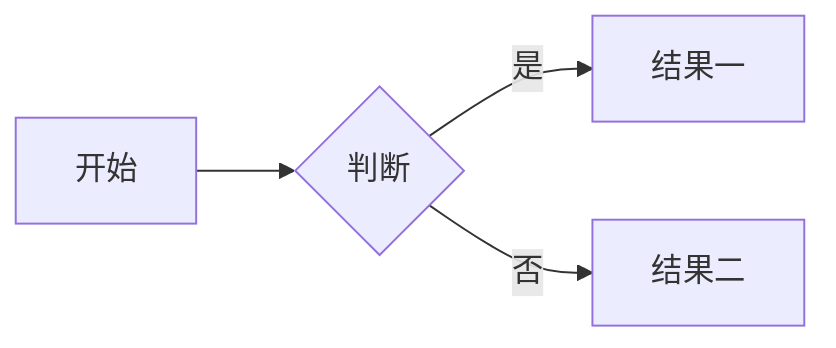

本站使用 **Hexo** 与 **Shoka** 主题，渲染器为 `hexo-renderer-multi-markdown-it`。下文每项先给**效果**，再给**编写语法（可复制）**；分类封面路径规则见第一节。

<!-- more -->

---

## 〇、首页「分类」卡片与封面图（必读）

Shoka 只在检测到 **`cover.jpg` 真实存在** 时，才把该分类加入首页分类区，并用作卡片背景。

### 路径规则（常见错误对照）

| 要求 | 说明 |
|------|------|
| 目录必须是 | `source/_posts/`（单数 `source`、下划线 **`_posts`**，不是 `sources`、不是 `_post`） |
| 文件名必须是 | `cover.jpg`（小写扩展名；部署在 Linux 时大小写敏感） |
| 子文件夹名字 | 必须等于该分类的 **slug**（见下表），不是中文分类名本身 |

**slug** 由 Hexo 计算：先看 `_config.yml` 里 `category_map` 是否把中文名映射成英文，再对映射结果做 `slugize`（一般与映射串一致，如 `programme`）。

本站 `category_map` 与文件夹名对应示例：

| 文章里写的分类名 | 请在 `source/_posts/` 下使用的文件夹名 |
|------------------|----------------------------------------|
| 程序设计 | `programme/cover.jpg` |
| 网络安全 | `cyberscurity/cover.jpg` |
| CTF | `ctf/cover.jpg` |
| ACM | `acm/cover.jpg` |
| 美术作品 | `art/cover.jpg` |
| 游戏设计 | `gamedesign/cover.jpg` |
| 留学语言 | `english/cover.jpg` |
| 体育 | `pe/cover.jpg` |
| 生活杂项 | `life/cover.jpg` |
| 学术科研 | `research/cover.jpg` |

**多级分类** 若 slug 为 `父slug/子slug`，则路径为：`source/_posts/父slug/子slug/cover.jpg`。

**注意**：Hexo 里只有**至少出现过一篇文章**的分类才会存在；没有文章的分类不会出现，也不会显示封面位。

**编写语法（路径示意，非 Markdown）**

```text
博客根目录/
  source/
    _posts/
      programme/cover.jpg
      cyberscurity/cover.jpg
      life/          （可先只放 .gitkeep，日后加 cover.jpg）
      research/
```

主题已使用站点根目录下的 `source_dir` 绝对路径检测文件；若仍无图，请核对文件夹名是否与上表 slug **完全一致**（含拼写，如 `cyberscurity`）。

**若显示成主题默认图、不是你放的图**：请确认封面文件在 **`source/_posts/<slug>/cover.jpg`**（用 **slug 文件夹名**，不要用中文分类名当目录名）。模板已使用 `url_for('<slug>/cover.jpg')` 指向本站生成产物；若把 `_config.shoka.yml` 里 `statics` 设成 CDN 地址，旧版主题会把封面也拼进 CDN，导致永远不是你站点上的文件。

---

## 一、Front Matter 常用项

### 效果

| 字段 | 作用 |
|------|------|
| `title` / `date` / `updated` | 标题与时间 |
| `categories` / `tags` | 分类与标签 |
| `cover` / `photos` | 封面与文首相册 |
| `math` / `mermaid` / `chart` / `quiz` | 按需开启扩展 |
| `comment: false` | 单篇关闭评论（若已接入） |

### 编写语法

~~~yaml
---
title: 文章标题
date: 2026-03-31 12:00:00
updated: 2026-03-31 18:00:00
categories:
  - [程序设计]
tags:
  - Hexo
  - Shoka
math: true
mermaid: true
chart: true
quiz: true
cover: https://example.com/cover.jpg
photos:
  - /images/a.jpg
  - /images/b.jpg
comment: false
---
~~~

单层分类：`categories: [网络安全]`。多层：`categories: [父类, 子类, 系列]`。

---

## 二、标题与文字

### 效果

### 二级到六级标题

正文从 `##` 起跳；一级 `#` 一般由主题当页题。

### 强调与行内代码

*斜体*、**粗粗**、***粗斜***、`行内代码`、~~删除线~~。

++下划线++、++波浪线++{.wavy}、++着重点++{.dot}、==荧光高亮==、~~红色删除~~{.danger}

[赤橙黄绿青蓝紫]{.rainbow} [标签样式]{.label .success} [警告标签]{.label .warning}

快捷键：[Ctrl]{.kbd} + [C]{.kbd .red} · 下标上标：H~2~O、29^th^

### 剧透与注音

!!鼠标悬停可见的剧透内容!!

!!选中可见的模糊剧透!!{.bulr}

注音：{汉字^hàn zì}、{東京^とうきょう}

### Emoji

:smile: :heart: :rocket: :memo:

### 编写语法

~~~markdown
## 二级标题
### 三级标题

*斜体* **粗体** ***粗斜*** `行内代码` ~~删除线~~
++下划线++ ++波浪线++{.wavy} ++着重点++{.dot}
==荧光高亮== ~~红色删除~~{.danger}
[彩虹文字]{.rainbow} [标签]{.label .success}
[Ctrl]{.kbd} + [C]{.kbd .red}
H~2~O  29^th^

!!悬停剧透!!
!!模糊剧透!!{.bulr}
{汉字^hàn zì}

:smile: :heart:
~~~

---

## 三、列表与任务

### 效果

1. 第一项
2. 第二项
   - 嵌套
3. 第三项

- 苹果
- 香蕉

- [ ] 待办
- [x] 已完成

{.primary}

### 编写语法

~~~markdown
1. 第一项
2. 第二项
   - 嵌套无序
3. 第三项

- 无序 A
- 无序 B

- [ ] 未完成
- [x] 已完成

{.primary}
~~~

（任务列表与 `{.primary}` 之间需**空一行**。）

---

## 四、引用与分割线

### 效果

> 普通引用一段文字。


书摘或名言。


### 编写语法

~~~markdown
> 引用内容
~~~

~~~liquid

书摘内容

~~~

水平分割线：单独一行的 `---`（上下空行更清晰）。

---

## 五、链接与图片

### 效果

[站内](/archives/) · [外链](https://hexo.io/zh-cn/docs/) · https://github.com/hexojs/hexo


### 编写语法

~~~markdown
[链接文字](https://url)
[站内](/archives/)


~~~

---

## 六、表格

### 效果

| 表头 A | 表头 B |
|--------|--------|
| 单元格 | 单元格 |

### 编写语法

~~~markdown
| 表头 A | 表头 B |
|--------|--------|
| 单元格 | 单元格 |
~~~

（启用 `markdown-it-multimd-table` 后还可写更复杂的合并/多行表格，见主题文档。）

---

## 七、代码块与 Prism

### 效果

```plain
plain 文本块
```

```javascript
function hello(name) {
  console.log("Hello, " + name);
}
```

```javascript 示例：行高亮 mark:2-3
function add(a, b) {
  return a + b;
}
```

```bash 命令行 command:("[user@local ~]$":1||"# ":3)
echo "普通用户"
sudo -i
whoami
```


const a = 1;
const b = 2;
const c = 3;
const sum = a + b + c;


### 编写语法

**围栏代码块**：首行写 \`\`\`语言名，可选同一行加标题、`mark:行号`、`command:...`，换行写代码，闭合 \`\`\`。

~~~markdown
```javascript
console.log(1);
```

```javascript 标题文字 mark:2-3
第1行
第2行高亮
第3行高亮
```

```bash 说明 command:("$":1-2)
echo a
echo b
```
~~~

**Hexo 标签代码块**：

~~~liquid

const x = 1;

~~~

---

## 八、数学公式（须 `math: true`）

### 效果

行内：$\sqrt{x^2+y^2}$

$$
\int_0^1 x^2 \, dx = \frac{1}{3}
$$

### 编写语法

文首 Front Matter：`math: true`

~~~markdown
行内：$\sqrt{x^2+y^2}$

$$
\int_0^1 x^2 \, dx = \frac{1}{3}
$$
~~~

---

## 九、Mermaid（须 `mermaid: true`）

### 效果



### 编写语法

文首：`mermaid: true`

~~~markdown

~~~

---

## 十、Frappe Charts（须 `chart: true`）

### 效果

```chart
{
  "data": {
    "labels": ["一月", "二月", "三月", "四月"],
    "datasets": [
      { "name": "访问量", "type": "line", "values": [12, 18, 9, 22] }
    ]
  },
  "type": "axis-mixed",
  "height": 240,
  "colors": ["#7cd6fd"]
}
```

### 编写语法

文首：`chart: true`

~~~markdown
```chart
{
  "data": {
    "labels": ["A","B"],
    "datasets": [{ "name": "示例", "values": [1, 2] }]
  },
  "type": "bar",
  "height": 240
}
```
~~~

---

## 十一、提示框 container

### 效果

:::default
默认
:::

:::primary
primary
:::

:::info
info
:::

:::success
success
:::

:::warning
warning
:::

:::danger
danger
:::

:::danger no-icon
无图标
:::

### 编写语法

~~~markdown
:::info
内容
:::

:::danger no-icon
无图标内容
:::
~~~

（`:::类型` 与结束行 `:::` 成对；类型含 default / primary / info / success / warning / danger。）

---

## 十二、标签卡与折叠

### 效果

;;;demo 说明
第一张卡内容。
;;;

;;;demo 代码
```python
print("tab")
```
;;;

+++ 折叠标题
折叠正文。
+++

+++primary 紫色折叠
内层 Markdown
+++

### 编写语法

~~~markdown
;;;同一ID 标签显示名
第一张卡
;;;

;;;同一ID 另一标签
第二张卡
;;;

+++ 折叠标题（可选风格前缀）
内容
+++
~~~

（`+++primary 标题` 表示带颜色风格的折叠。）

---

## 十三、Pullquote

### 效果


左侧 pullquote。


正文段落文字……


右侧 pullquote。


更多正文……

### 编写语法

~~~liquid

引文


段落正文……


引文

~~~

---

## 十四、多媒体 media

### 效果


- title: 演示（单曲）
  list:
    - https://music.163.com/#/song?id=29732235


### 编写语法

~~~liquid

- title: 列表名
  list:
    - https://music.163.com/#/playlist?id=数字



- name: 视频标题
  url: https://视频直链.mp4

~~~

---

## 十五、友链 links

### 效果


- site: Shoka 主题
  owner: amehime
  url: https://github.com/amehime/hexo-theme-shoka
  desc: Hexo 主题
  image: https://cdn.jsdelivr.net/gh/amehime/shoka@latest/images/avatar.jpg
  color: "#e9546b"


### 编写语法

~~~liquid

- site: 站点名
  owner: 站长
  url: https://...
  desc: 描述
  image: https://头像.jpg
  color: "#e9546b"

~~~

外链 YAML 也可放 `source/` 下文件，用 ``。

---

## 十六、练习题（须 `quiz: true`）

### 效果

下列哪项是列表写法？ {.quiz}

- 错项
- 正确项 {.correct}
- 错项
{.options}
> 解析文字

### 编写语法

文首：`quiz: true`

~~~markdown
题干文字 {.quiz}

- 选项A
- 选项B {.correct}
{.options}
> 解析
~~~

（多选、填空等见主题 `theme-shoka-doc/special.md`。）

---

## 十七、摘要 <!-- more -->

### 效果

列表与首页只展示本标记**上方**内容。

### 编写语法

~~~markdown
这是摘要，会出现在列表。

<!-- more -->

从这里起是全文。
~~~

---

## 十八、参考

- [Hexo 文档](https://hexo.io/zh-cn/docs/)
- [hexo-renderer-multi-markdown-it](https://github.com/amehime/hexo-renderer-multi-markdown-it)
- 主题示例目录：`themes/shoka/example/source/_posts/`

---

*若某项未渲染：检查 Front Matter 开关、`_config.yml` 中 markdown 插件；本站 `markdown.render.html: false` 时不宜依赖文内原始 HTML。*
