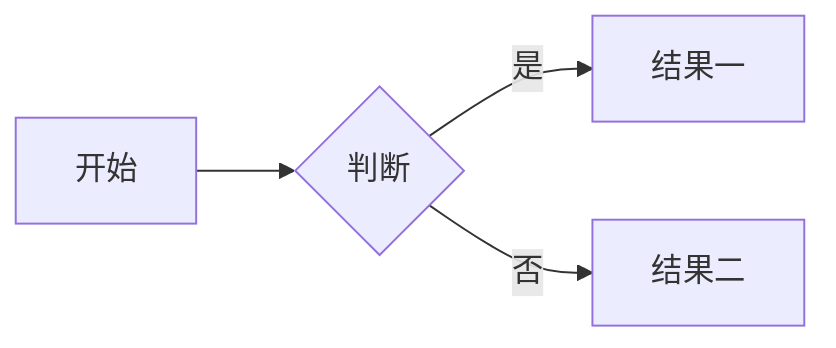
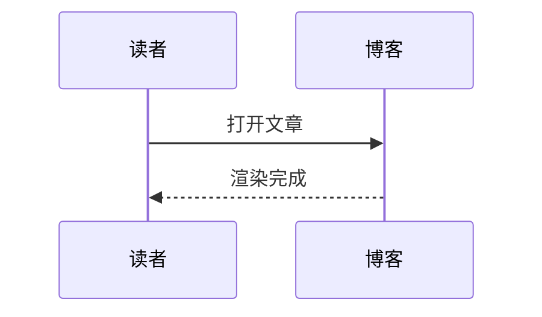

本站使用 **Hexo** 与 **Shoka** 主题，渲染器为 `hexo-renderer-multi-markdown-it`。下文在**同一篇文章**中演示常用 Front Matter、标准 Markdown 与主题扩展语法；撰写新文时可复制对应段落按需删改。

<!-- more -->

---

## 一、Front Matter 常用项

文章顶部 `---` 之间为 YAML，常见字段包括：

| 字段 | 作用 |
|------|------|
| `title` / `date` / `updated` | 标题与时间 |
| `categories` / `tags` | 分类与标签 |
| `cover` | 列表与分享用封面图 |
| `photos` | 文首相册（本页已演示两张图） |
| `math` | `true` 时启用下方 KaTeX 公式 |
| `mermaid` | `true` 时启用 Mermaid 图 |
| `chart` | `true` 时启用 Frappe Charts 图 |
| `quiz` | `true` 时启用文末练习题样式 |
| `comment: false` | 若已接评论，可单篇关闭 |

分类可写单层或多层，例如：`categories: [父类, 子类, 系列名]`。本站 `_config.yml` 中 `category_map` 会把中文分类映射为 URL 中的英文 slug。

---

## 二、标题与文字

### 二级到六级标题

正文从 `##` 起跳即可；`#` 一级标题一般由主题用作文章标题，文中少用。

### 强调与行内代码

*斜体*、**粗粗**、***粗斜***、`行内代码`、~~删除线~~。

++下划线++、++波浪线++{.wavy}、++着重点++{.dot}、==荧光高亮==、~~红色删除~~{.danger}

[赤橙黄绿青蓝紫]{.rainbow} [标签样式]{.label .success} [警告标签]{.label .warning}

快捷键示例：[Ctrl]{.kbd} + [C]{.kbd .red}

下标与上标：H~2~O、29^th^

### 剧透与注音

!!鼠标悬停可见的剧透内容!!

!!选中可见的模糊剧透!!{.bulr}

注音示例：{汉字^hàn zì}、{東京^とうきょう}

### Emoji

:smile: :heart: :rocket: :memo:

---

## 三、列表与任务

有序列表：

1. 第一项
2. 第二项
   - 嵌套无序
3. 第三项

无序列表：

- 苹果
- 香蕉
- 橙子

任务列表（可在列表后用属性块改样式，**中间空一行**）：

- [ ] 待办事项
- [x] 已完成

{.primary}

---

## 四、引用与分割线

> 普通引用：这是一段引用文字。


书摘或名言可以写在 blockquote 标签内。


---

## 五、链接与图片

[站内相对链接示例](/archives/) · [外链示例](https://hexo.io/zh-cn/docs/) · 自动识别链接：https://github.com/hexojs/hexo


---

## 六、表格（含 multimd 扩展）

| 表头 A | 表头 B |
|--------|--------|
| 单元格 | 单元格 |

---

## 七、代码块与 Prism 高亮

行内说明：使用三个反引号包裹语言名。

```plain
无高亮纯文本块（语言名 plain）
```

```javascript
function hello(name) {
  console.log("Hello, " + name);
}
```

带**标题**与**行高亮**（同一行写语言名后的参数，具体规则见主题文档）：

```javascript 示例：行高亮 mark:2-3
function add(a, b) {
  return a + b;
}
```

```bash 命令行提示符 command:("[user@local ~]$":1||"# ":3)
echo "普通用户"
sudo -i
whoami
```

Hexo 标签代码块（标题与标记行）：


const a = 1;
const b = 2;
const c = 3;
const sum = a + b + c;


---

## 八、数学公式（`math: true`）

行内：$\sqrt{x^2+y^2}$

块公式：

$$
\int_0^1 x^2 \, dx = \frac{1}{3}
$$

---

## 九、Mermaid（`mermaid: true`）





---

## 十、图表 Frappe Charts（`chart: true`）

```chart
{
  "data": {
    "labels": ["一月", "二月", "三月", "四月"],
    "datasets": [
      { "name": "访问量", "type": "line", "values": [12, 18, 9, 22] }
    ]
  },
  "type": "axis-mixed",
  "height": 240,
  "colors": ["#7cd6fd"]
}
```

---

## 十一、提示框（container）

:::default
默认提示框
:::

:::primary
primary 强调
:::

:::info
info 说明
:::

:::success
success 成功
:::

:::warning
warning 警告
:::

:::danger
danger 危险
:::

:::danger no-icon
无图标危险块
:::

---

## 十二、标签卡与折叠

;;;demo 说明
这里是**第一个**标签页，可放列表、代码等。
;;;

;;;demo 代码示例
```python
print("Hello from tab")
```
;;;

+++ 折叠：默认风格
折叠内可以写普通 Markdown。
+++

+++primary 折叠：带风格
:::info
折叠里的提示框
:::
- 列表项一
- 列表项二
+++

---

## 十三、Pullquote 侧栏引文

正文段落与 pullquote 搭配时，引文会突出在某一侧（左右各演示一次）。


这是 **pullquote left**：适合强调摘要或金句。


Lorem ipsum dolor sit amet，consectetur adipiscing elit。多写几句方便看出 pullquote 与正文混排时的版式：静态博客的排版依赖主题 CSS，若某端显示异常，可对照 `themes/shoka/example/source/_posts/tag-plugins.md` 调整 surrounding 段落长度。


这是 **pullquote right**：同样用于突出引用块。


Maecenas tempus molestie arcu，et fringilla mauris placerat ac。再补一段正文，避免 pullquote 紧贴文末影响观感；实际写作时按内容自然分段即可。

---

## 十四、多媒体 `media`（音频列表示例）

下列标签由主题提供，适合在文中嵌入网易云歌单/单曲等（需网络可访问对应服务）。


- title: 演示（单曲）
  list:
    - https://music.163.com/#/song?id=29732235


视频同理可使用 ``，内写 YAML 列表（`name` / `url`），详见主题文档「特殊功能」一节。

---

## 十五、友链块 `links`


- site: Shoka 主题
  owner: amehime
  url: https://github.com/amehime/hexo-theme-shoka
  desc: Hexo 主题
  image: https://cdn.jsdelivr.net/gh/amehime/shoka@latest/images/avatar.jpg
  color: "#e9546b"


---

## 十六、练习题（`quiz: true`）

点击选项可查看解析（样式依赖主题与 `quiz: true`）。

下列哪项是 Markdown 列表常见写法？ {.quiz}

- 仅用 `#` 开头
- 使用 `-` 或 `*` 作为无序列表 {.correct}
- 使用 `//` 注释
{.options}
> 无序列表以 `-`、`*` 或 `+` 开头。

---

## 十七、摘要与更多

列表页、首页只显示 `<!-- more -->` **上方**的内容；下方为全文。长文请把导读写在前面并尽早插入 `<!-- more -->`。

---

## 十八、参考

- [Hexo 文档](https://hexo.io/zh-cn/docs/)
- [hexo-renderer-multi-markdown-it](https://github.com/amehime/hexo-renderer-multi-markdown-it)
- 主题示例：`themes/shoka/example/source/_posts/` 下 `markdown.md`、`code-highlight.md`、`tag-plugins.md` 及 `theme-shoka-doc` 系列

---

*本文用于本站语法对照与效果回归；若某项未渲染，请检查 Front Matter 开关与 `_config.yml` 中 markdown 插件是否启用。*
